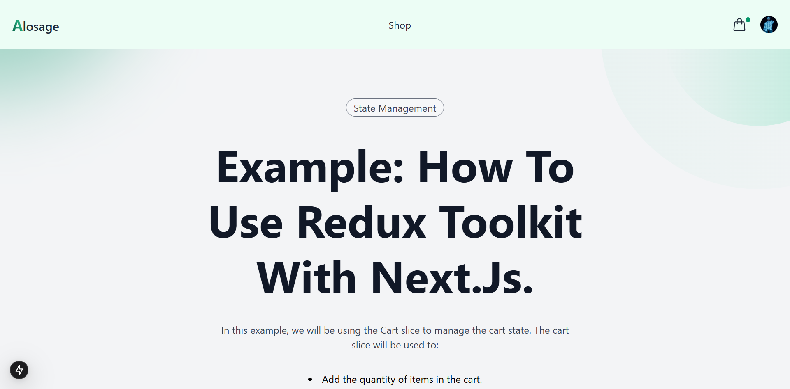

<div align="center">
<br/>

<br/>
  <div>
    
    
    

  </div>

<h3 align="center">State Management with Redux Toolkit</h3>

<div align="center">
  <a href="">🌐View live demo🌐</a>
</div>
  
</div>

## 📋 <a name="table">Table of Contents</a>

1. 🤖 [Introduction](#introduction)
2. ⚙️ [Tech Stack](#tech-stack)
3. 🔋 [Features](#features)
4. 🤸 [Quick Start](#quick-start)


## <a name="introduction">🤖 Introduction</a>

A Next.js 15 state management example using Redux Toolkit. The example showcases how to manage the cart state in a Next.js application using Redux Toolkit.


## <a name="tech-stack">⚙️ Tech Stack</a>

- React 19
- Next.js 15
- Clerk
- TailwindCSS
- TypeScript

## <a name="features">🔋 Features</a>

👉 **Custom Redux Store Provider**: Avoids turning the entire application into a Client Component at global level `layout.tsx`.

👉 **Add**: the quantity of items in the cart..

👉 **Remove**: the quantity of items in the cart.

👉 **Update**: the quantity of items in the cart.

👉 **Persist Cart state**: Items in the cart are persisted even when navigating to the checkout page.

👉 **Auth & User Management**: using Clerk.

👉 **Minimalistic Design**: Fresh and simple UI with only the essential pages for ease of use and a clean aesthetic.

and many more, including **React 19**, **Next.js 15** and **Clerk** features 

## <a name="quick-start">🤸 Quick Start</a>

Follow these steps to set up the project locally on your machine.

**Prerequisites**

Make sure you have the following installed on your machine:

- [Git](https://git-scm.com/)
- [Node.js](https://nodejs.org/en)
- [npm](https://www.npmjs.com/) (Node Package Manager)

**Cloning the Repository**

```bash
git clone https://github.com/0ddFl3xx/state-management.git
cd state-management
```

**Installation**

Install the project dependencies using npm:

```bash
npm install 
```

Currently, **Next.js 15** and **React 19** are still new to the market. The above command may result in errors, so you might need to --force install the peer dependencies. In that case, you can use the following command:

```bash
npm install --force
```

**Set Up Environment Variables**

Go to the file named `.env` in the root of your project, rename it to `.env.local` and add the following content:

```env
NEXT_PUBLIC_CLERK_PUBLISHABLE_KEY=
CLERK_SECRET_KEY=
```

Replace the placeholder values with your actual Clerk credentials. You can obtain these credentials by signing up & creating a new project on the [Clerk website](https://clerk.com/).

**NOTE:** Avoid committing your `.env.local` file to the repository.

Go to your .gitignore file and add the following line:

```env
# env files (can opt-in for commiting if needed)
.env*
```

**Running the Project**

```bash
npm run dev
```

Open [http://localhost:3000](http://localhost:3000) in your browser to view the project.

